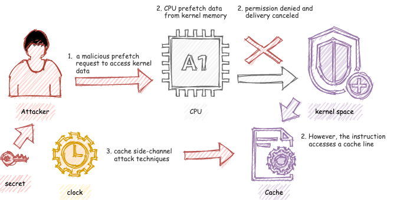
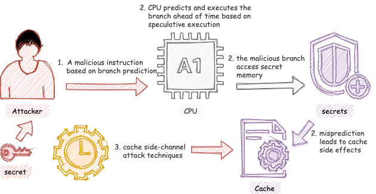

# Side-Channel Attacks

Computations performed by physical devices often leave **observable side effects** beyond the computation’s nominal outputs. For example, physical effects such as *power consumption*, *electromagnetic radiation*, or *acoustic noises* can be leveraged to provide additional information. **Side-channel attacks** focus on exploiting these side effects to extract otherwise-unavailable secret information, such as cryptographic keys or passwords. 

In this report, we are going to take a quick tour of some **side channels**, such as power consumption or execution time. We would talk about some examples of **countermeasures** against side-channel attacks. Besides, we would look at ***Meltdown*** and ***Spectre***, which are two dangerous vulnerabilities that exploit CPU side-channel flaws.

## Introduction 
Side-channel attacks mainly contain two steps. The attacker **measures hardware's physical traits** during some operations (power, current, timing, electromagnetic radiation, etc.), and then **performs data analysis** to learn information. Besides monitoring the normal operations, attackers might deliberately control operations via some malicious input to force abnormal execution. 

Side-channel attacks are quite successful. One reason being is that different from other attacks, side-channel attacks target the weakness of **the implementation of the algorithms**, rather than the algorithms themselves. Hence a mathematically sound algorithm may become vulnerable against the side-channel attacks. Moreover, side-channel attacks are *hard to catch or detect* since they typically would not leave any trace. 

## Side-Channels
Here are some side-channels, or physical features that can be utilized by the attackers: 
- Power consumption or current
- Timing or delay
- Electromagnetic radiation
- Optical
- Acoustic
- Output signals

Specifically, we are going to talk about *power consumption* and *timing*. 

### Power and Current 
Chips power consumption mainly comes from three sources: 
1. **the dynamic power** 
2. **the leakage current**  
3. short circuit and others

Information may be leaked from **dynamic power**, which is needed to charge and discharge the capacitance. `P ∝ C V² f` tells us that the power is *proportional* to the effective capacitance of the switching activity. A switching happens when we change a logical zero to a logical one or a logical one to a zero, which would incur a *higher power assumption* than the case when the logical value remains at zero or one.

On the other head, **leakage current** will leak information about the system since the leakage current of a large device is related to its *input value*. For example, for a 2-input NAND gate, we have
| Input   | Leakage(nA) |
| ---- | ----- |
| 00      | 37.84       |
| 01      | 100.30      |
| 10      | 95.17       |
| 11      | 454.50      |

From the table (table source from reference [1]), the leakage current when both input signals are 1 is about *12 times higher* than the leakage when the input vector is 0 and 0. 


### Timing Or Delay
Timing or delays relates to **the execution time** of an operation. The differences in execution time offer attackers insight into the system's internal information. 

For example, a **control flow** will leak data when different branches execute very different instructions. To illustrate, we have this if statement, `if (a != b) x = 8; else x = c - d;`. We observe that it takes a longer time to perform the false branch `x = c - d` than the true branch `x = 8`. If the attacker manages to measure the execution time of this portion of the code, then `a != b`, or whether `a` and `b` have the same value, can be deduced.  

Another example is about **data dependency**. Consider a very simple multiplication operation `x = x * y;`. We observe that the execution time depends on the value of `y`. `y` being 190 takes longer than y being 0 or 1. Moreover, if `y` has a value like 64, the execution time will be fast since 64 is a power of 2 and *logical shifts* take a shorter time. 

What's worse, monitoring execution time can reveal if **cache miss** or **pipeline stall** happens. This might leak the cache memory content.


## Mitigation / countermeasure
With the recent growth in the prevalence and sophistication of side-channel attacks, defense against side-channel attacks has developed along two main axes: 
1. **Hiding**-based approaches try to hide secrete information from side channels and make it more challenging for the attacker to extract user data.
2. **Masking/blinding**-based approaches try to remove the correlation between input data and side-channel emissions.

### Hiding 
One example of hiding-based approaches is **noise generator**, which adds noise to the side channel at execution time. For example, to disguise the data-dependent side-channel information, it may *use extra circuits to draw current randomly or add random delay to certain paths or logics units*. Or, it may *keep the total power consumption constant* to fail power analysis or *add electromagnetic noise* to avoid electromagnetic radiation side effects. 

Another example is **balanced logic styles**. To prevent side-channel attacks, special logic units can be used during the design phase to *make the power/delay independent of the input data or the secret key*.

Besides, adding **asynchronous logical** components in the design will *eliminate clocks and disable global synchronization*, and hence hide more complexity under the hardware implementation and prevent some physical side effects. 

Moreover, the **low power design** technique can reduce the power consumption of the system and hence *weaken the signals*, which increases the difficulty of side-channel attacks.

Last but not least, side-channel can be **shielded** or filtered **physically** to prevent information leaks. For example, *an upper-level metal layer* can prevent electromagnetic radiation, and *sound dampening material* can reduce acoustic emission.

### Masking/Blinding
For instance, at **gate-level**, we can XOR the output of a logical unit with pre-selected data values to mask the real values. 

It can also be applied at **word-level**, as we give the logical units randomized input data. However, this will increases the design complexity because the internal design of logical units now needs to be modified to generate the correct output. 


---


## Meltdown or Spectre

Meltdown and Spectre are two critical architectural flaws in CPUs that allow applications to *access protected memory*. Both take advantage of the ability to extract information from instructions that have executed on a CPU using the **CPU cache** as a side-channel. 

Since Meltdown and Spectre happen at **hardware-level**, while software vulnerabilities are comparatively easy to patch, this class of vulnerability requires architectural changes for future products. For existing devices, software patches, such as limiting or removing access to specific CPU instructions, can assist in minimizing risk, though at the cost of significantly *lowering the performance*. However, it's hard to say that complete risk mitigation is possible. 


#### Meltdown


Before talking about Meltdown, let's talk about **out-of-order-execution**, which is an important performance feature of modern processors to overcome latency of busy execution units. Rather than only executing instructions in the sequential program order, the CPU executes instructions **"out of order" as soon as all required resources are available**. Doing so minimizes wasted clock cycles. While the execution unit of current operations is occupied, other execution units can run ahead.

Meltdown exploits a **race condition between memory access and privilege level checking** while an instruction is being processed. Although privileged data is not delivered to the unprivileged user, it causes CPU **cache side effects**. An attacker can monitor the processor's performance using the cache side-channel attack and discern important details about the protected data.

In short, Meltdown attacks are conducted **in three steps**:
1. The attacker crafts a **malicious prefetch request** and the content of a chosen memory location is loaded into a register.
2. An instruction **accesses a cache line** based on the secret content of the register.
3. The attacker uses **cache side-channel attack techniques** to deduce the accessed cache line and hence the secret stored at the chosen memory location.



The name "*meltdown*" means the attacker meltdowns the barrier or walls that are protecting the sensitive information and hence the attacker can look at whatever memory they want. 

#### Spectre


Before talking about Spectre, let's talk about **branch prediction** and **speculative execution**. As the CPU wants to minimize the time waiting and therefore improve performance, it learns the branching patterns, and speculatively executes instructions ahead of time based on the predictions.
```c
if(happens_often) { // CPU is here - "technically"
    // read memory you're not supposed to 
    // CPU is speculatively executing some bad stuff
}                   // things are technically ok 
```
When a branch is mispredicted, the speculatively-executed instructions will be discarded. However, there are some side-effects such as CPU cache changes. By measuring the latency of memory access operations, the cache can be used to extract values from speculatively-executed instructions.

In short, Spectre attacks are conducted in **three steps**:
1. The processor is mistrained to make "**an exploitably erroneous speculative prediction**." (quoted from the *Spectre paper*[5])
2. The processor speculatively executes instructions "from the victim context into a **microarchitectural covert channel**". (quoted from the *Spectre paper*[5])
3. The sensitive data is recovered. This can be done by *timing access to memory addresses in the CPU cache*.




The vulnerability is called "*Spectre*" to reference speculative processing, and this problem will "haunt" the computer world for many years to come.


#### Differences

Spectre and Meltdown present huge challenges across the industry since its discoveries in 2018. While both read sensitive information from memory via **speculative execution**, Meltdown is distinct from Spectre attacks in two main ways. 
1. Meltdown exploits a race condition if **out-of-order execution** to leak kernel memory, whereas Spectre exploits **branch prediction**.
2. Meltdown exploits a vulnerability specific to **many Intel and some ARM** processors with the privilege escalation issue. In contrast, Spectre attacks work on **a wider range of processors**, including **most** AMD and ARM processors. 


---

## Reference
[1] [Lecture](https://www.youtube.com/watch?v=NyDdzQ6PvIY&list=PL2jykFOD1AWZRNhehPCsDLhfRkM1abYHd&index=21&t=6s&ab_channel=intrigano): *Hardware security - Introduction to Side Channel Attacks* by University of Maryland 

[2] [Article](https://www.intertrust.com/blog/side-channel-attacks-strategies-and-defenses/): *Side-channel attacks: strategies and defenses* by Jake VanAdrighem

[3] [Lecture](https://www.youtube.com/watch?v=CHGLEB3Vqcw&list=PL2jykFOD1AWZRNhehPCsDLhfRkM1abYHd&index=24&ab_channel=intrigano): *Hardware security - More Attacks and Countermeasures* by University of Maryland

[4] [Meltdown Paper](https://meltdownattack.com/meltdown.pdf): *Meltdown: Reading Kernel Memory from User Space*

[5] [Spectre Paper](https://spectreattack.com/spectre.pdf): *Spectre Attacks: Exploiting Speculative Execution*

[6] [Article](https://www.techrepublic.com/article/spectre-and-meltdown-explained-a-comprehensive-guide-for-professionals/): *Spectre and Meltdown explained: A comprehensive guide for professionals* by James Sanders 

[7] [Article](https://www.computerhope.com/jargon/m/meltdown-and-spectre.htm): *Meltdown and Spectre* by Computer Hope

[8] [Article](https://danielmiessler.com/blog/simple-explanation-difference-meltdown-spectre/): *A Simple Explanation of the Differences Between Meltdown and Spectre* By Daniel Miessler

[9] [Comic](https://xkcd.com/1938/) on XKCD site

[10] The links of the images are noted in the markdown source file
