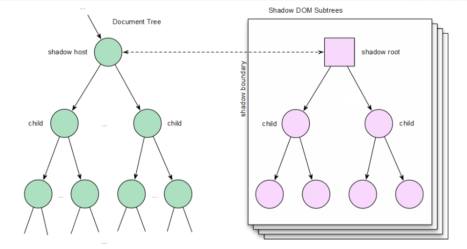
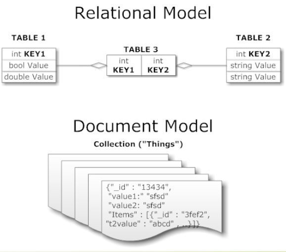
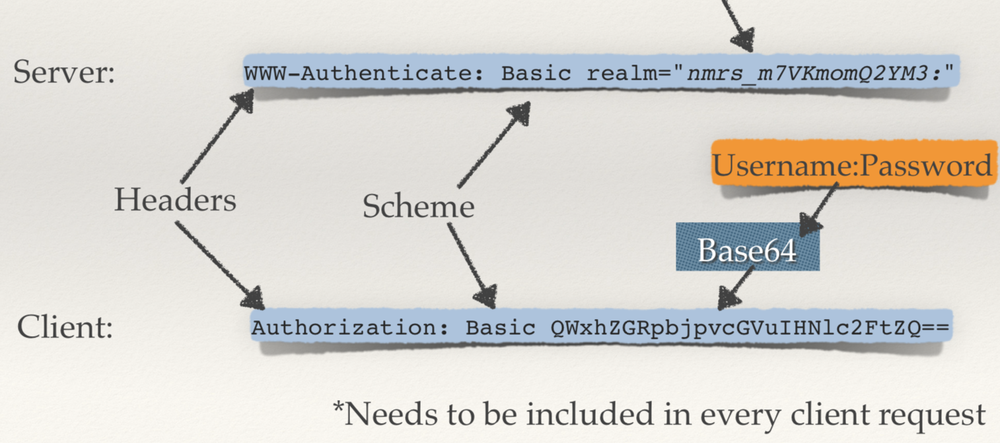

### Wev-based Architecture Course Notes
> Vanderbilt University Fall 2019, taught by Professor *Graham Hemingway*
> 
> Transcribed by *Xue Zou*

#### Contents
##### Exam 2
- [Saving State](#Saving-state)
- [React Intro](#React-intro)
- [More React](#More-react)
- [React Lists & Events](#React-lists-and-events)
- [Intro to NodeJS](#intro-to-nodejs)
- [Express & NodeJS](#React-and-nodejs)
- [Server Templates](#templates-on-the-server)
- [MongoDB](#mongodb)
- [MongoDB with NodeJS](#MongoDB-with-NodeJS)
- [Sessions](#Sessions)
- [RESTful APIs](#RESTful-APIs)
- [More REST](#More-rest)
- [HTTP Authentication](#Http-authentication)
- [More Authentication](#more-authentication)
- [Intro to Redis](#intro-to-redis)


---
#### Saving State

- Saving State in the Client
- **URL** to the Rescue
    - URLs can capture quite a bit of state. The path, query string and fragment can all be used for passing info
    - e.g. `/map/foo/@66.6, -66.66z`
- Enter HTTP **Cookies**
    - east to use - kind of
    - hard to keep it confidential 
    - good lib support
    - limited in size : 4kb, present state send every request keep it small
    ```javascript
    function setCookies() {
        document.cookie = "username=heminggs"
        document.cookie = "lat=66.66"
    }

    let cookieValue = document.cookie.replace(/(?:(?:^|.*;\s*)test2\s*\=\s*([^;]*).*$)|^.*$/, "$1");
    ```
    - cookies in client (includes info like expired date, path)

- **sessionStorage**
    - sessionStorage mechanism is available to store key-value pairs
    - very easy to use and can store *much more* than cookies. 
    - Data is wiped at the end of the session / presist until "end of session" 
    - only arailable in domain 
    - larger in size: 10+MB
    - easy API and very good lib support
    ```javascript
    function useSessionStorage() {
        sessionStorage.setItem(“username”, “heminggs”);
        sessionStorage.setItem(“lat”, 66.66);
        sessionStorage.removeItem(lat);
        console.log(sessionStorage.length);
        alert(sessionStorage.key(1));
    }
    ```

- **localStorage** 
    - localStorage is a more persistent version of sessionStorage. Sticks around for as long as you want.
    - same 10MB storage
    ```javascript
    function useLocalStorage() {
        localStorage.setItem(“username”, “heminggs”);
        localStorage.setItem(“lat”, 66.66);
        localStorage.removeItem(lat);
        console.log(localStorage.length);
        alert(localStorage.key(1));
    }
    ```

- Beyond Simple Storage
    - HTML5 continues to evolve, and even more powerful storage mechanisms are becoming available. For example, **IndexedDB** and **WebSQL** are emerging options
        - IndexedDB
            - Acts like a large-scale key-value store Transactional in nature
            - Allows for structured queries Potentially unlimited in size
            - More complicated API
        - WebSQL
            - Acts like a SQL database 
            - Generally built upon SQLite Potentially 
            - unlimited in size 
            - Need to be comfortable with SQL
- Client State in SPA
    - still need to preserve state across page reload
    - still need to coordinate state with thhe server
    - within the SPA, just use js


#### React Intro

- View Layer
    - Template, Rendering, Events
    - An SPA framework may provide several layers for our client-side SPA: routing, events, data and views
- **React** is an open-source *Facebook* project that concentrates on the view layer. It aims to enable rapid development of high-performance views
    - integrate view logic and template
    - speed up DOM changes
    - tightly couple events and logic
    - leverage cuttinng-edge tools
- History / Facebook Fail
    - Facebook embraced theh concept of a web application early. After failing to develop a strong web-based client thhey fell back to native app development.
    - 2009 mibile web app
    - 2012 mobile native app
    - mobile web app
- How to improve performance
    - the most central tenant react is **minimize unnecessary DOM changes**. These are really expensive
        - minimize DOM changes
        - reduce repaint
        - reduce reflow
        - control when page is repainted
    - [Why reflow and Repaint is bad](http://www.thatjsdude.com/interview/dom.html)
    
- Shadow DOM: *Creation of React*
    - React was the first view library to strongly embrace the Shadow DOM for performance improvement (min set of changes)
    - maintain 2nd DOM (el Shadow DOM) 
    - make changes to Shadow DOM first
    - When ready to redraw page, diff Shadow DOM and actual DOM
    - make aonly necessary changes to primrary DOM
    

- React Basics
    - Component Lifecycle
        - Mounting & Rendering
        - Updating
        - Unmounting
    - Events
    - JSX (a syntax extension to JavaScript, combine HTML and js)
- Minimal React Components
    ```javascript
    import React, {Component} from 'react';
    // importing React, Sub-classing React.Component
    // Setting the exports, Class ctor and rdnering
    export class Landing extends Component{
        constructor(props){
            super(props); 
        }
        render() {return <div></div>};
        //returning html? Babel help us transpile
    }
    ```
- React Component Lifecycle - **Mounting**
    - Every React component can choose to respond to several standardized methods. These responses define the basic behavior of the component. Here are the methods related to mounting and rendering. 
        - `constructor()` - optional
        - `static getDerivedStateFromProps()` - optional
        - `render()` - mandatory
        - `componentDidMount()` - optional 
        - `componentWillMount()` - deprecated 

- React Component Lifecycle - **Updating** 
    - Every React component goes through the same lifecycle steps at various points. The props and state of the component are updated frequently.
        - `static getDerivedStateFromProps()` - optional
        - `shouldComponentUpdate()` - render()
        - `componentWillReceiveProps()` - deprecated 
        - `componentWillUpdate()` - deprecated
- React Component Lifecycle - **Other**
    - cleanup when a component is being unmounted, and handle errs
        - `componentWillUnmount()` - optional
        - `componentDidCatch()` - optional 

- Integrating into Our App
    - same conceptual pattern as Backbone views
        - import view, instantiate view withh data, insert into DOM
        - `ReactDOM.rdner(<Landing data = {data}/>, document.getElementByID('mainDiv'));` 


#### React
- React O' Rama

    - goal: respond to events, bind to data, and interact with the server
- **Props & State**
    - Props contain immutable data (from parent) and state contains dynamic data within a React view
        + default Props
        + propTypes
        + props usage
    ```javascript
    class HelloMessage extends Component {
        render() {
            return <div>
                <div>{this.props.name}</div>
                <div>{this.props.fpp}</div>
            </div>;
        }
    }
    HelloMessage.propTypes = {
        name: propTypes.string.isRequired
    }
    HelloMessage.defaultProps = {foo : 0};
    ```
    ```javascript
    ReactDOM.render(<LandingView name = 'john'/ >, document.getElementById('mainDiv'))
    ```

- View State
    - State contains all of the dynamic data in React views and the view responds to changes in state. 
        - initial state
        - setState
        - State usage
        ```javascript
        class HelloMessage extends Component {
            constructor(props) {
                super(props);
                this.state = {name: 'Graham'};
            }
            someEvent(ev) {
                this.setState({name: 'foo'});
            }
            render() {
                return <div>Hello {this.state.name}</div>;
            }
        }
        // replacing the existing state
        // rerender the child if has the prop
        // state can be passed to children as props
        ```


- **Events & Bindings**
    - React makes responding to events easy. A little it more difficult is figuring out object bindings with ES6
        - Bind event targets
        - Capture events
        - Handle events & manage state changes 
    ```javascript
    class HelloMessage extends Component {
        constructor(props) {
            super(props);
            this.handleClick = this.handleClick.bind(this);
            // bind function to the object this.handleClick = this.handleClick.bind(this) // may go away later
        }
        handleClick(ev) {
            this.setState({ name: ev.target.value });
        }
        render() {
            return <div onClick={this.handleClick}></div>            
        }
    }
    ```

- **Routing & React**   
    - First SPA manual routing allows us to select the view to render for a given URL
    ```javascript
    let setRoute = function(route) {
       if (route !== window.location.pathname) {
            // Push to history
           window.history.pushState({}, '', route);
        }
        switch(route) {
            case "/index.html":
                render(<Landing/>, document.getElementById(“mainDiv”));
                break;
            case "/profile.html":
                ...
                break;
        }
    };
    ```
    - [React-router](https://reacttraining.com/react-router/web) is the most widely used React component for managing routing. It looks like a JSX object.
    ```javascript
    render() (
        <BrowserRouter> // manage page history
            <div>
            // idenify the route & render the right view
                <Route exact path = "/" render={props => <Landing {...props} names = {data.data}/>} />
                <Route path = "/profile/:id" render={props => <div>Profile Page</div> } />
            </div>
        </BrowserRouter>, document.getElementById('mainDiv'));```
- Changing Pages
    - React Router has two diff mechanisms for navigating to another page: **Link and history**
    - `<Link to = "/logout">Log Out</link>` Route to which to navigate
    - ```this.props.history.push(`/profile/${username}`);``` Programmatically navigate to a new route
- Getting Ajax-ish
    - reach out and grab data to populate the React views
    - bind to a lifecycle
    ```javascript 
    class HelloView extends Component {
    ...
    componentDidMount() {
        ...
        $.ajax({...})
          .then(data => {
            this.setState({ foo: data });
          })
        ...
    }
    render() { return <div>{this.state.foo}</div>; }
    ```
    - wait until the view has mounted into the DOM
    - execute AJAX request
    - Use setState to update the view with the data
    - pass down data / function bounded to the method of root component (can be function execute events) (backed up the hierarchy)
    - function alter the data flow the props back to children
    - action tie to particular method componentDidMount() to fetch data, not constructor
    - initial state if the data is received, if not it render the whole page (user level interaction)

- Stateless React Components 
    - render method without constructor
    - do not need to use this.state, don't need a full component 
    ```javascript
    let Landing = ({names}) => { // Component Name & Destructed Props
        const myList = names.map((name, index) => {
            return <li key={index}>{name}</li>;
        });
        return [
            <Link key = {2} to = "/profile/bar">Click here!!!</Link>
            <ul key={1}>{myList}</ul>
        ]; // return rendered JSX
    };
    ```
    - Also referred to as "*Pure Functional*" components
    ```javascript
    const children = this.props.foo.map((el, i) => <li key = {i}>{el}</li>); 
    // i index, another parameter group object
    // missing key produces warning
    ```
- conmmand `ifconfig` in terminal to manipulate network interface configuration


#### React Lists and Events
- Building Lists & Keys
- Component-ization
    - focused (very reusable) components
- A Quick Note on *Styling*
    - pull styling into the component
    - CSS-in-JS
    - Creates with React components
    - Blend with Custom components
    ```javascript
    import styled from "styled-components";
    const Clicker = styled.div`
        color: red;
        font-size: 20pt;
    `;
    export class Landing extends Component {
        ...
        return() {
            return <div>
                <Clicker onClick={this.handleUp}>Up</Cliker>
                {this.state.count}
                <Clicker onClick={this.handleDown}Down</Cliker>
            </div>
        }
    }
    ```
- Conditionalize render for Ajax
    ```javascript
    render() {
        return this.state.loaded ? <NamesList list={this.state.names}/> : <div>Loading...</div>;
    }
    ```

---

#### Intro to NodeJS
- History
    - Node.js was first built in 2009 by *Ryan Dahl* from Joyent. Took the Chrome V8 Javascript runtime and combined with with a native event loop (libuv) and some low-level APIs. 
        - Joyent owned the copyright and lead the community
        - Node grows very rapidly and evolves quickly at first
        - As more production systems run Node, evolution slows
        - In 2014 Fedor Indutny started IO.js as fork of Node.js. Focused on faster evolution and incorporation of feedback and enhancements
        - Feb 2015, IO.js and Node.js agree to recombine with IO.js codebase taking the lead, but Node taking the brand.
        - Moving forward plans include better ES(x) support and JS runtime independence (Chakra) 
    - Hot Off the Presses (10/4/18) [Node.JS and Javascript Foundation sto Merge](https://www.linuxfoundation.org/news/2018/10/node-js-foundation-and-js-foundation-announce-intent-to-create-joint-organization-to-support-the-broad-node-js-and-javascript-communities/) 

- NodeJS vs. Browser
    - Just as we saw for the browser, NodeJS runs in a single thread of execution. Some things are similar to being in a browser context, others are very different.
        - Same V8 runtime engine as Chrome and leverages a similar event loop
        - Different means of including libraries (for now)
        - No DOM API. So how do we manipulate a document? 
        - OS-level primitives are available
        - Tightly coupled package manager

- Simple Server
    ```javascript
    let http = require("http");

    let server = http.createServer((req, res)) => {
        res.writeHead(200, { "Content-Type": "tetx/plain" });
        res.end("Hello, world!\n");
    });
    server.listen(8080);
    console.log("server running on port 8080");```
- More than just HTTP
    ```javascript
    let net = require('net');
    let server = net.createServer(socket => {
        socket.on('data', data => {
            socket.write(data);
    }); });
    server.listen(1337, '127.0.0.1');
    ```
- Buit-In Libraries
    - NodeJS has a number of very well written built-in libraries for performing basic tasks. But, they have focused thhese libraries on necessary minimums.
- NodeJS **Module** System
    - import 
    ```javascript
    let http = require('http');
    let net = requre('net');
    ``` 
    - export
    ```javascript
    module.exports = function() { /* do sth */};
    module.exports = { myFunc: function(){}, myConst: 100};
    ```
        - setting module.exports is all that is necessary
        - looks to ./node_modules
        - falls back to local files
- package.json
    - records all of the details about module or app so that it can be shared and easily reused
        - simple JSON structure
        - defines dependencies
        - records repository  
        - allows smart script running
        - aware of development reqs
- Node Package Manager 
    - default tool for managing Node modules
    - `npm install`
    - `npm update`
    - records repository
    - allows smart script running
    - aware of development reqs.
    - ...
    - `npm out` can identify updated pakages
    - `npm up` update / pull new versions of the packages
- `npm init`
    - create new directory, `npm init` - Give reasonable values, create internal directory *structure*, create initila server code, start it running!

#### Express and NodeJS
- NodeJS Request/Response
    - NodeJS's HTTP module is pretty easy to use (req & res)
    - we can directly access all of the inbound HTTP request through an IncomingMessage type object:
    ```javascript
    let handler = (req, res) => {
        console.log(‘Headers: ‘ + req.headers);
        console.log(‘Verb: ‘ + req.method);
        console.log(‘URL: ‘ + req.url);
        console.log(‘URL2: ‘ + url.parse(req.url, true));

        res.writeHead(200, {'Content-Type': 'text/plain'});

        res.end('Hello, World!\n');

    }
    ```
- NodeJS Response
    - Node's HTTP. module allow us to do quite *a bit* with the outgoing res object (called a ServerResponse):
    ```javascript
    let body = JSON.stringify({
 // stringify - can't direct send JSON
        username: 'heminggs',

        email: 'graham.hemingway@vanderbilt.edu'

    });

    res.writeHead(200, {

        'Content-Length': body.length,
 
        'Content-Type': 'text/plain' 
    }
);
    res.end(body);
    ```

- Simple Express Server
    ```javascript
    let express = require('express');
    let app = express(); // creates an Express app
    // can create multiple app, multiple ports
    app.get('/', (req, res) => {
        res.send('Hello World!');
    }); // setup a route
    let server = app.listen(8080, () => {
        console.log(‘Express listening on 8080’);
    }); // generate response, first response wins
    ```
- The **Pipeline**
    - Express acts like a simple pipeline thhat you configure yo handle requests (a sequential pipeline)
    ```javascript
    let app = express();
    app.set('view engine', 'pug'); // set server options
    const pugPath = path.join(__dirname, './');
    app.set('views', pugPath); // set server options
    let staticPath = path.join(__dirname, '../../public');
    app.use(express.static(staticPath)); // Step 1
    app.use(logger('dev')); // Step 2
    app.use(bodyParser.json({})); // Step 3
    app.use(bodyParser.urlencoded({ extended: true })); // Step 4
    // Render a simple route
    app.get('/foo', (req, res) => { // Step 5
        res.send('Hello World!');
    }));```

- The Request
    - Express extends the base HTTP request w/ a bunch of addtional info useful for generating the response, e.g.:
        - `req.body` data sent to server
        - `req.path` path for the request
        - `req.method` VERB being used by client
- The Response
    - Express provides a set of methods on the response object thhat let you build the response that is sent to the client.
        - `res.cookie()` look at cookies from client
        - `res.end()` finish response 
        - `res.send()` send data to client
        - `res.status()` set response to status code

- The Router
    - a built-in router, can create more routers
    ```javascript
    app.get('/', (req, res) => { // GET VERB being used by client
        res.send('hello world');
    });
    let router = express.Router();
    app.use(router);
    // path to be matched + callback function (req, res)
    router.post(/^\/commits\/(\w+)(?:\.\.(\w+))?$/, (req, res) => {
        let from = req.params[0];
        let to = req.params[1] || 'HEAD';
        res.send('commit range ' + from + '..' + to);
    });
    ```
- More Complex 
    - mult router in different order (instead of pipeline all running)
    - router is more dynamic
    - app.post()... url hhas some pattern matching

#### Templates on the Server
- Simplifying HTML Gerneration
    - very verbose, requires end-tags
    - things repeat over-and-over
    - JS to build DOM is tedious
    - doing everything client-side can slow down response to the user
- Templates for Generation
    - 
- ExpressJS and Jade
    - One of the most popular template language sis Pug. Simple to install into ExpressJS pipeline and adapt your pat handlers to leverage it.
    ```javascript
    // pipeline config
    app.engine("pug", require("pug").__express);
    app.set("views", path.join(__dirname, "./views"));
    ```
    ```javascript
    // pug template
    html(lang="en")
        head
            title!=title
        body
            h1!=message
    ```
    ```javascript
    // path handler
    app.get("/foo", (req,res) => {
        res.render("landing.pug", {title: "Hey", message:"Hello, world!" });
    })
    ```
    - white space matters
    - first time really fast in server part
    - server side then take over  


#### MongoDB
- mongoDB = "Hu **mongos** us DB"
    - open-source
    - document-based
    - "high performance, high availability"
    - Automatic scaling
    - C-P on [CAP](https://en.wikipedia.org/wiki/CAP_theorem) (Cannot simultaneously satisfy *Consistensy*, *Availability*, *Partition tolerance*)
- Other NoSQL Types
    - Key/value (Dynamo)
    - Columnar/tabular (HBase)
    - Document (mongoDB)
    - [MongoDB vs. SQL Server](http://www.aaronstannard.com/mongodb-vs-sql-server/)
    
- Motivations
    - Problems with SQL 
        + Rigid Schema
        + Not easily scalable (designed for 90's tech or worse)
        + Requires unintuitive joins
    - Perks of [mongoDB](http://www.slideshare.net/spf13/mongodb-9794741?v=qf1&b=&from_search=13)
        + (Querying with mongo super easy! SQL hard)
        + easy to interface with common languges (Java, js php, etc.)
        + DB tech should run anywhere (VM's, cloud, etc.)
        + Keeps essential features of RDBM's while learning from key-value noSQL systems
        + **dynamic schema, ability to scale horizontally and perform multi- data center replication**
    - (SQL does server validation)
    - non-relational (no joins) make *horizontal* scaling practical


- [Data Model](https://docs.mongodb.com/manual/)
    - Document-based (max 16 MB)
    - Documents are in **BSON** format, consisting of field-value pairs
    - Each document stored in a **collection**
    - Collections
        - Have index set in common
        - like **tables** of relational db's
        - documents do not have to have uniform structure
- [JSON](http://json.org/)
    - "Javascript Object Notation"
    - Easy for humans to writeread, easy for computers to parse/generate
    - Objects can be nested
    - Built on
        - name/value paris
        - ordered list of values
- [BSON](http://bsonspec.org/)
    - Binary JSON
    - Binary-encoded serilaization of JSON-like docs
    - also allows "referening"
    - embedded struct reduces need for joins
    - goals
        - lightweigth, traversable, efficient (decoding and encoding)
        - (super set of json)
        - (can't put function into doc)
    - [BSON Types](https://docs.mongodb.com/manual/reference/bson-types/)
- the _id field
    - by default, each doc contains an _id field
    - immutable
    - mongo: shard take a big plain of glass and break it into pieces
    - partition SQL scale horizontally (massive db server)
- mongoDB vs. SQL

    | mongoDB                   | SQL 
    |:-------------------------:| ---
    | Document                  | Tuple 
    | Collection                | centered 
    | PK:_id Field              | PK: Any Attribute(s)
    | Uniformity not Required   | Uniform Relation Schema
    | Index                     | Index
    | Embedded Structure        | Joins
    | Shard                     | Partition

- **CRUD** Create, Read, Update, Delete, Using the Shell
    - `db` to chheck which db you're using
    - `show dbs` show all databases
    - `use <name>` switch db's/make a new one
    - `show collections` see what colltions exist
    - (db's are not actually created until you inser data)
    - `db.<collection>.insert(<document>)` to insert documents into a collection/make a new collection
- CRUD: Inserting Data
    - `db.<collection>.insert({<field>:<value>})` 
        - insert one document
        - insert a document with a field name new to the collection is inherently supported by the BSON model
        - to insert mutiple documents, use an array
- CRUD: Querying
    - Done on collections  
    - Get all docs: `db.<collection>.find()`
        - returns a cursor, which is iterated over shell to display first 20 results 
        - `Add.limit(<number>)` to limit results
    - Get one doc: `db.<collection>.findOne()` 
    - To match a specific value:
        - `db.<collection>.find({<field>:<value>})`
        - `db.<collection>.find({<field1>:<value1>, <field2>:<value2>})`
        - `db.<collection>.find({ $or:[<field>:<value1><field>:<value2>] })`
    - checking for multiple values of same field
        - `db.<collection>.find({<field>: {$in [<value>, <value>]}})` 
    - Including/excluding document fields
        - `db.<collection>.find({<field1>:<value>}, {<field2>: 0})` 
        - `db.<collection>.find({<field>:<value>}, {<field2>: 1})`
    - Find documents with or w/o field
        - `db.<collection>.find({<field>: { $exists: true}})`  
- CRUD: Updating
    - upsert: if true, creates a new doc when none matches search criteria
    ```
    db.<collection>.update( {<field1>:<value1>}, {$set: {<field2>:<value2>}}, {multi:true} )
    //all docs in which field = value 
    //set field to value
    //update multiple docs
    ```
    - to remove a field
        - `db.<collection>.update({<field>:<value>}, { $unset: { <field>: 1}})`
    - replace all field-value pairs
        - `db.<collection>.update({<field>:<value>}, { <field>:<value>, <field>:<value>})`  
        - Note: This overwrites ALL the contents of a document, even removing fields
- CRUD: Removal
    - Remove all records where field = value
        - `db.collection.remove({<field>:<value>})`
    - as above, but only remove first document
        - `db.<collection>.remove({<field>:<value>}, true)`  
- CRUD: Isolation
    - By default, all writes are **atomic** **only** on the level of a single document.
    - This means that, by default, all writes can be interleaved with other operations.
    - You can isolate writes on an **unsharded** collection by adding _$isolated:1_ in the query area:
        - `db.<collection>.remove({<field>:<value>, $isolated: 1})`
        - [shard](https://en.wikipedia.org/wiki/Shard_(database_architecture)): a horizontal partition of data in a database or search engine; each shard: seperate server, to seperate load


#### Schema Design
- 
    |RDBMS|MongoDB
    |---|---
    |Database|Database
    |Table|Collection
    |Row|Document
    |Index|Index
    |Join|Embedded Document
    |Foreign Key|Reference
    - RDBMS: _Relational Database Management System_
- Intuition - why database exist in the first place
    - Why can't we just write progrmas that operate on objects?
        - Memory limit
        - We cannot swap back from disk merely by OS for the page based memory management mechanism
    - Why can’t we have the database operating on the same data structure as in program?
        - where mongoDB comes in  
- Mongo is basically **scheme-free**

- Patterns: **Embedding** v.s. **Linking**
    - Embedding is a bit like pre-joining data
    - Document level operations are easy for the server to handle
    - Embed when the “many” objects always appear with (viewed in the context of) their parents.
    - Linking when you need more flexibility (change relationship frequently, update frequently)
        - no embedding in SQL, write a big json document in one, break it apart, and then linking
        - Pros and cons for embedding & Linking
            - one query render the page (embedding)
            - update efficiently (linking)
                - link more queries
                - change the username email adress? way easier... immediately rerendered.
                - if embedded? then changes would be more work
        - one to one relationship vs. one to many relationship
        - Embedding: (16 MB) still easy to mash out

- Many to many relationship
    - can put relation in either one of the documents
    - focus how data is accessed queries (write a lot or change a lot)
- *embed a little info but link full info*
- What is bad about SQL
    - hard data join

- SQL relational, schemated, 
    - SQL Structured Query Language, requires that you use predefined schemas to determine the structure of your data. same structure. up-front prep

- A noSQL database
    - **dynamic schema** for unstructured data, col oriented, document oriented, graph-based or organized as a KeyValue store.
    - create documents without having to first define their structure
    - each document can have its own unique structure
    - the syntax can vary from database to database
    - add fields
    - very **scalable** (horizontally scalable)

#### MongoDB with NodeJS
- Application Data Analysis
    - Each app needs to be analyzed to determine what data needs to be stored, and what type of persistence is appropriate
        - In-Memory Key-Value
            - High Performance
            - Transient
            - Simple structure
            - downside: if machine shut down, whole shut down
        - SQL DB
            - Robust
            - highly **structured**
            - transactional
        - Document-Oriented DB
            - Scalable
            - Flexible structure/schema
            - loose object relationship
        - Graph DB
            - Scalable
            - Algorithm necessity
            - Relationship oriented
        - Search Engine
            - High query throughout
            - Indices above structure
            - search facilities 
- Entities & Relationships
- MongooseJS
    ```javascript
    let mongoose = require('mongoose');

    mongoose.connect(‘mongodb://localhost/test', options);

    let Cat = mongoose.model('Cat', { name: String });
    let kitty = new Cat({ name: 'Tiger' });

    kitty.save(err => {
        if (err) // ...
        console.log('meow');
    });
    // Async activities, need call back, done saving call the callback
    // (promises, asyn libs)
    ```
- Connection
    ```javascript   
    // simple connection
    mongoose.connect('mongodb://localhost/test');

    let url = 'mongodb://localhost:32768/foobar';
    let options = {
        db: { native_parser: true }, // use native_parser, some use faster parser that translate data to binary form
        server: { poolSize: 5 },
        replset: { rs_name: 'myReplicaSetName' },
        user: 'myUserName',
        pass: 'myPassword' // robust auth between server and database
    }
    mongoose.connect(url, options).then(...);
    ```

- Schemas - Guess We Still Need Them
    - We need schemas consistency. But it will not be the MongoDB server that implements them
    
- Mongoose Schemas
    - define and enforce schemas, but in the NodeJS process - not the DB server. Mongoose makes that easy and flexible.
        - type: String Number Date Buffer Bollean Mixed ObjectID Array
    ```javascript
     let User = new Schema({
        'username': { type: String, required: true, index: { unique: true } },
        'hash':     { type: String, required: true },
        'salt':     { type: String, required: true },
    }); // never save password as plaintext, hashing not reversible
    ```
- **Refernces** - Joins, Kind-of
    - Mongoose makes it east to embed one document into another, but you can also do a tyoe of join
    ```javascript
    let Person = Schema({
        _id : Number,
        name : String
    });

    // populate the doc, run the query do the join
    // hyprid document, nothing change in the document, mongoose doing multiple queries
    let Story = Schema({
        _creator : { type: Number, ref: 'Person' },
        title    : String,
        fans     : [{ type: Number, ref: 'Person' }]
    });
    ```
    ```javascript
     Story
        .findOne({ title: 'Once upon a timex.' })
        .populate('_creator')
        .exec((err, story) => {
            if (err) return handleError(err);
            console.log('The creator is %s', story._creator.name);
    });
    ```

- Another dame pipeline
    - focused on extending specific functionality
    - Operations `init` `invalidate` `save` (pre and post) `remove`
        -  - pre -> f(x) -> post ->
    - Execution `serial` `parallel`
- Validation
    ```javascript
    // can extend our base schemas to include validation
    let User = new Schema({
        phone: {
            type: String,
            validate: {
                validator: function(v) {
                    return /d{3}-d{3}-d{4}/.test(v);
                },
            message: '{VALUE} is not a valid phone number!'
            }
        }
    });
    ```
    ```javascript
    User.pre('save', function(next) {
        // Sanitize strings
        this.first_name     = this.first_name.replace(/<(?:.|\n)*?>/gm, '');
        this.last_name      = this.last_name.replace(/<(?:.|\n)*?>/gm, '');
        next(); // next() is defined by Mongoose
    });
    ```

#### Sessions
- Starting to save state in the **server**
    - (disadv. server crashed, lost the cookies)
    - don't let the client tell us that!
    - A **Hash Table** in server session
    - use server-side to manage logging in
        - initial client rquest
        - Server initializes session
            - Generate sessionID (stored in hash table)
                - `cookie: sessionID, data:{}`
            - Respond w/ sessionID
        - Next client request
            - Attach sessionID
        - Associate session
            - Lookup sessionID 
            - Attach session to request
- Server session in ExpressJS
    ```javascript
     let app = express();
    ...
    // Setup pipeline session support
    app.use(session({ // insert into express pipeline
        name: 'session', // session identifier
        secret: 'ohhellyes',  
        resave: false, // session update / save
        saveUninitialized: true, // cookie properties
        cookie: {
            path: '/',
            httpOnly: false,
        }
    }));
    ```
    - now req has a session object, we can read adn write it
    ```javascript
    // read from session
    // Check to see if user is logged in
    if (!req.session.user) {
        res.status(401).send({ error: 'unauthorized' });
    } else {
        ...
    }
    // write to request session
    // Regenerate session when signing in to prevent fixation
    req.session.regenerate(() => {
        req.session.user = user;
        // If a match, return 200:{ username, primary_email }
        res.status(200).send({
            username:       user.username,
            primary_email:  user.primary_email
        });
    });
    ```
    - scaling session? failure?
    - session store externalize session (session would be persistent in (caching, redix))

#### RESTful APIs
- Representative State Transfer
    - one method of defining the access API for web-based app
    - Concept created by **Roy Fielding** in 2000 (for his PhD)
    - Focus is on data/object/resource interactions - not on a UI or any presentation
    - Builds a common approach for scalable, intuitive APIs
- How to RESTify
    - front end as an external client, using the api from the back-end, two different teams
    - static server(HTML, SPA, images) <-request client code-> *client* <-Request data-> API Server
    - app's API is a stand-alone product!
- Tenets of REST
    - In his PhD, Fielding proposed a number of principles. These are the goals of a RESTful API. Remember, there are a number of ways of achieving these goals.
        -  Client-server
        -  Layered
        -  Stateless (should not provide any specific state of individual calls)
        -  Cacheable (making it more efficient)
        -  Client-executable code
- Can we be **Stateless**
    - hard((there is some state server hhas to maintain)), but efficient
    - carefully evalute which aspects can be made stateless or really need to have state maintained
        - Authentication
        - Multi-step processes (never believe the client then not slateless anymore)
        - Multi-party interactions
        - Logic simplification
        - Performance
- Some Simple API routes that follow REST principles (self-explanatory)
    - `HEAD/v1/users/heminggs` does the user Heminggs exist
    - `DELETE /v1/game/1198f91ns3`
    - `POST /v1/game`
    - `GET /v1/users?q=hem&sort=asc&limit=50`
- User the VERB
    - Safe Operations `GET` `HEAD`
        - Only used for reading info. Nothing can change in the dataset
    - Idempotent Opertions `PUT` `DELETE`
        - Changes the dataset, but repeated calls do not change it more
    - Other operations `POST`
        - Application specific behavior
        - also idempotent when we create sth new

-**Versioning**
    - APIs change over time. App should provide some means allowing clients to select which version they are using.
    - support legacy longer, specify what version of thhe rest api like `v1`
    some text saying which version
    developer
        - In API `GET /v1/users/heminggs`
        - Accept Header
            - `GET /users/heminggs`
            - `Accept: application/vnd.foo.v1+json`
        - Custom Header
            - `GET /users/heminggs`
            - `X-API-Version:1`
- **Cache it** 
    - We want caching to occur throughout the application. Getting the client to cache data is the best - no request necessary at all! (like changed resource if not same (img))
    - _ETag_
        - An arbitrary string for the version of a representation. Make sure to include the media type in the hash value, because that makes a different representation. (ex: ETag: `686897696a7c876b7e`)
        - create a hash besed on the document {username…””}
        - f(x) … “asdasdaf134”
        - ETag give the hash
        - server get the hash
        - already sent the document respond the 204 
        - nothing new
        - client already know
        - (new ETag new body)

- [API Deisgn Cheet Sheet](https://github.com/RestCheatSheet/api-cheat-sheet#api-design-cheat-sheet)
- A Few Good Headers
    - Client -`Accept: application/json,application/xml`-> REST Server
        - Accept
            - Desired content format
            - Desired *priority of formats*
            - Version
            - Use .json or .xml as alternative
    - Client <-`Content-Type: application/json`- REST Server
        - Content-Type: Format of contained data
- Use the Noun
    - A well crafted URL path is the key to RESTful APIs. Concentrate on mapping resources to nouns in the path, and separate IDs with nouns
    - `POST /v1/user` `GET /v1/user/heminggs/games`
    - `GET /v1/user/heminggs/game/18d8wjs892` v.s.`GET /v1/game/18d8wjs892`
- Colletions
    - Frequently we need to access both individual resources and a collection of those resources. The API should make this distinction clear:
    - `GET /v1/users` `GET /v1/user/heminggs`
- Queries
    - Resource queries happen frequently. We need to support a wide range of query operators to allow flexible resource discovery.
    - `GET /v1/users` 
        - filter By
            - *paginiation* (start page & size limit) 
                - built directly into find in mongoose/mongo, little efforts and queries significatly more efficient
            - sort order 
            - fields 
    - `GET /v1/users?q=h&limit=50&start=3&sort=asc&fields=first,last,dob`
        - query = h start with h, limit to 50 pages start on o page 3, sorted in asc order, only care about first last date of birth
- Real-World Examples
    - [Github](https://developer.github.com/v3/)
    - [Twitter](https://developer.twitter.com/en/docs)
    - [Google](https://developers.google.com/drive/api/v3/about-sdk)


#### More Rest
- Joi for validation
    ```javascript
    // Schema for user info validation
    let schema = Joi.object().keys({
        username:       Joi.string().lowercase().alphanum().min(3).max(32).required(),
        primary_email:  Joi.string().lowercase().email().required(),
        first_name:     Joi.string().allow(''),
        last_name:      Joi.string().allow(''),
        city:           Joi.string().default(''),
        password:       Joi.string().min(5).required()
    });
    // Validate user input
    Joi.validate(req.body, schema, { stripUnknown: true }, (err, data) => {
        if (err) {
            const message = err.details[0].message;
            res.status(400).send({ error: message });
        } else {
            ...
        }
    });
    ```
- More Restful 
    - more **granular** ( & modular) API, less tied to one client's needs for one page
    - break calls apart
    - (seperate game and user) _Get /v1/user/game_
- **GraphQL**
    - the API defines schemas, and clients use those to query and modify the data via the API
    - GraphQL is a newly emerging approach to API design. Clients build structured queries - almost schema like.
    - (rest api) one query of hero and... query of friends, and names...
    - (GraphQL) get name of friends... define many layers as we want
    - template the queries
    - examples
        - [Facebook graph api](https://developers.facebook.com/docs/graph-api/)
- [What is Rest](https://restfulapi.net/)

#### Authentication
- authentication v.s. authorization
    + validating who the user claims to be vs. validating that the user has permission to do what they are requesting
    + client - _Requests Resource_- > Application
    + client <- _Requests Credentials_- Application
    + client _Provides credentials_ -> Application
    + client <- _Provides Resource_ - Application

- **Basic auth** is a very simple protocol built directly into every browser. Header fields are used to communicate all authentication info
    - 
    - (All of the client-server communication in Basic Auth is done in "plain" text. Therefore, we MUST have HTTPS (here the authorization is essencially authentication))
    - Browser handles some on the client, and the framework handles these on the server
    - 
    - RULE never sending password plaintext
    - our app didn't have the encrption yet
    ```javascript
    let basicAuth = require('basic-auth');

    let auth = (req, res, next) => {
        const unauthorized = res => {
            res.set('WWW-Authenticate', 'Basic realm=foo');
            return res.send(401);
        };
        let user = basicAuth(req);
        if (!user || !user.name || !user.pass) {
            return unauthorized(res);
        };
        if (user.name === 'foo' && user.pass === 'bar') {
            return next();
        } else {
            return unauthorized(res);
        }; 
    };
    ```
    ```javascript
    app.get('/', auth, (req,res) => {
        res.send(200, 'Authenticated');
    })
    ```

- HTTP Digest Auth
    - Digest Authentication is also built into most browsers. Similar to Basic, it uses Header fields to communication credentials.
    - [What is Digest authentication](https://stackoverflow.com/questions/2384230/what-is-digest-authentication)
    - 
    - 
    - 
        - `qop`, `nonce` (The server gives the client a one-time use number (a nonce) that it combines with the username, realm, password and the URI request. The c
        - lient runs all of those fields through an MD5 hashing method to produce a hash key), `opaque`
        - using md5 hashing, reponse with `cnounce`

- Custom Authentication
    - Leverage HTTPS for security and encryption
    - not encrpted: only IP address
    - Better looking login screens
    - More contrl over credential caching
    - easy to extent username + password to Two-Factor (Before: Remeber me checkbox, store a cookie, as long as the cookie is recognized as a valid session -> now insecure)
    - now have the user do a password manager
    - Encryption via HTTPS is necessary
    - You must manage sessions & cookies
        - Most clients now auto-save passwords
        - Active management not as necessary 
    - Follow good practices on the server-side
        - Use bcrypt to hash the password in DB 
        - Never store plain-text password 
- Multi-factor Authentication
    - such as SMS message, Dongle with rolling code, biometric verification
- RFC 6238 TOTP
    - dominant standard (Dongle not physically)
    - Time-based One-Time Password
    - both sides agree on a one-tine key that defines clock behavior
- Two-factor authentication
    - generate one-time time key
    - request login: time-code
    - (Rolling code)
    - Google Authentication
    ```javascript
    // Generate User Token
    let secret = speakeasy.generateSecret({ length: 32 });
    { ascii: 'GUzHI6<e{.R/buov(J<iG!/:W0RZ{J>/',
    hex: '47557a4849363c657b2e522f62756f76284a3c6947212f3a5730525a7b4a3e2f',
    base32: 'I5KXUSCJGY6GK6ZOKIXWE5LPOYUEUPDJI4QS6OSXGBJFU62KHYXQ',
    otpauth_url: 'otpauth://totp/SecretKey?secret=I5KXUSCJGY6GK6ZOKIXWE5LPOYUEUPDJI4QS6OSXGBJFU62KHYXQ'
    }
    ```
    ```javascript
    // verify User Token
    let verified = speakeasy.totp.verify({
        secret: req.session.secret.base32,
        encoding: 'base32',
        token: req.body.twofactor
    });
    ```
    - Node pakage `speakeasy`


#### More User Authentication
- Authentication & Authorization
    - SSO
    - OAuth Example - Github
    - SAML Example - VUNetID
- Single Sign-On
    - Single Sign On is a powerful apporach to simplifying your application's user management and expanding your user base
        - Pros: simplify sign-up process, ease security concerns
        - Cons: data owned by other service, downtime due to others
        -  (risk that if they done your are done)
        -  Don't need to deal with password reset, data/customer owned by others
- A "simple" scheme
    - SSO get the code, validate token 
    - back and forth communication between SSO and our application
    - Last, 302 to complete login and client pass the second token
    - (second token validate the processing, and complete the login)
    - (Process depends on the trust between parties)
    - 
- VUNetID
    - vulink app, redirect back (using lib based on XML)
    - SAML Protocol (industry commercial standard)
    - (Key-pair) 
    - vulink.qstrl.con/metedata.xml
    - validate the public key (in the metedata) and corresponds ... private key in SSO
    - send back large doc, as we can mine out the user
- OAuth does nothing, purely for authentication, SAML protocal pass back documentation, if successful never talk to SSO provider again (since it send back info) but code more complex


#### Intro to Redis
- why cache
    - Many times users will read the same data many many times *before it must be changed*. Imagine Facebook... (user profile, user post, user photos)
    - data should get "cached" when it will be read frequenrly and without changes. This acclerates our app's content delievery
- What can we cache
    - Even our simple Game application could make good use of caching
    - Recently played games, user statistics, user profiles
- flow
    - client -(1st request)-> Web Server -> Redis Server -> (Mongo Server -> Web Server -> Redis Server)
    - client -(2nd Request)-> Web Server -> Redis Server -(data)-> web server (cut mongo out)
- **Redis**
    - Radis is a modern caching server. Written mostly by [Salvatore Sanfilippo](https://github.com/antirez/redis), it is now the default solution for this type of problem
    - low const & low compleixty
    - `redis-cli -p (portnumber from kitematic)` `get` `set`
    - redis: **rate-limiting** (use a ratecounting)
- Many different data structure
    - (use one line in the server to save the session info to redis)

#### HTTPS
- Let's Be Safe
    - HTTP unsecure -> HTTPS
        - Fully encrpts all traffic
        - Initiation costs cycles (load balancers)
        - Generally need to purchase from a CA (certificate from a third party)
        - Need to stay up to date
- Setting up
    - modify
    ```javascript
    let server = app.listen(8080,  function() {
        console.log('Example app listeing on' + server.address. port);
    })

    let server = https.createServer(options, app).listen(8443, function(){
        console.log('Example app listening on ' + server.address.port);
    })
    ``` 
- Certificate Gerneration
    - Usaully we rely upon Certificate Authorities to generate our certificates. Self-signed certificates are frequently used interally or for development & testing.
    - Chain of trust
        - [CAs provide a trusted chain of security](http://w3techs.com/technologies/overview/ssl_certificate/all)
        - Root certificates are pre-installed in browsers
        - Generate a certificate request
        - CA generates actual certificate
    - (owned the domain and actually is the owner)
- Generate CSR      
    - ownership of private key
    - A Certificate Signing Request initiates the certificate generation process.
    - Generate private key
    `openssl genrsa -des3 -out server.pass.key 2048`
    - Strip off password
    `openssl req -new -key server.key -out server.csr`
    - Generate CSR
    `openssl req -new -key server.key -out server.csr`
        - `Common Name` matters, e.g. localhost
    - generate server.csr using the csr
    could only use csr when one has the private key
    - send csr to the vender and send the cert back get `cerver.crt`    
- can use `certbot` connect to `Let s Encrypt`
- running certbot on the virtual machine after purchasing the domain name
`ls -al ~/.ssh/`
129.59 change the source to that so only Vandy student can come
